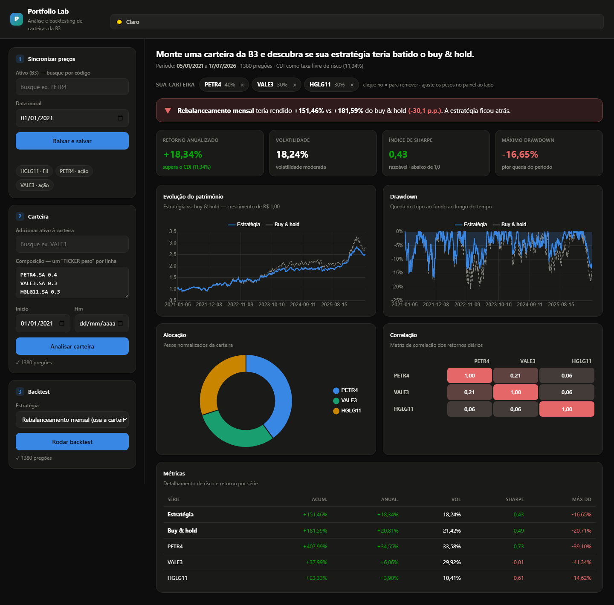

# Portfolio Lab

Aplicação web para **analisar e fazer backtest de carteiras de ações e FIIs da
B3** — monte uma carteira, veja métricas de risco/retorno e descubra se uma
estratégia teria batido o buy & hold, tudo num dashboard interativo.

**Demo ao vivo:** [INSERIR URL DO RENDER]

> Projeto de portfólio para demonstrar duas competências ao mesmo tempo:
> **engenharia de backend/dados** e **conhecimento do domínio financeiro**. O
> design completo está em [`SPEC.md`](SPEC.md).



<!-- Coloque a captura de tela em docs/dashboard.png (veja docs/README.md). -->

---

## O que faz

- **Baixa e armazena** o histórico diário de preços de ativos da B3 (via
  `yfinance`, tickers com sufixo `.SA`).
- **Calcula métricas de carteira**: retorno acumulado e anualizado, volatilidade
  anualizada, índice de Sharpe, *max drawdown* e matriz de correlação.
- **Faz backtest** de duas estratégias — cruzamento de médias móveis e
  rebalanceamento mensal — sempre comparadas contra buy & hold.
- **Visualiza tudo** num dashboard de página única (Chart.js): curva de equity,
  drawdown, alocação e heatmap de correlação, com autocomplete de tickers e uma
  carteira-exemplo que carrega sozinha ao abrir.

## Stack

- **Python 3.11+**
- **FastAPI** + **Uvicorn** (API + servidor ASGI)
- **SQLite** via **SQLModel** (banco em arquivo único)
- **yfinance** — histórico OHLCV
- **API SGS do Banco Central** — CDI como taxa livre de risco
- **brapi.dev** — universo de tickers da B3 para o autocomplete
- **Chart.js** (CDN) no frontend
- **pytest** — 49 testes rodando 100% offline

## Decisões técnicas de destaque

Os pontos que melhor mostram a preocupação com correção e robustez:

- **Upsert idempotente.** A tabela `Price` tem *unique constraint* em
  `(ticker, date)`; a sincronização usa `INSERT ... ON CONFLICT(ticker, date) DO
  UPDATE`, então re-sincronizar um ativo **atualiza as linhas no lugar, nunca
  duplica**. O mesmo código serve para a carga do seed. *(`app/store.py`)*
- **Sem look-ahead no backtest.** No cruzamento de médias, a posição é tomada com
  `signal.shift(1)` — age no **dia seguinte** ao sinal, para a estratégia nunca
  "espiar" o retorno que ela mesma tenta capturar. *(`app/backtest.py`)*
- **Sharpe com o CDI ao vivo.** A taxa livre de risco é o **CDI**, buscado em
  tempo real no Banco Central (SGS série 12, sem token). O cálculo aceita tanto
  um **escalar** quanto uma **Series por data**, alinhada aos retornos antes de
  subtrair o excesso. *(`app/metrics.py`, `app/data.py`)*
- **Degradação graciosa.** Se o BCB estiver indisponível, o Sharpe cai para
  `rf=0` e a resposta **informa isso**; se o brapi cair, o autocomplete usa uma
  lista curada offline. Nada quebra por falha de rede.
- **Offline-first no deploy.** O disco do Render é efêmero e o yfinance costuma
  ser bloqueado a partir de IPs de datacenter, então a carteira-exemplo é
  **semeada de um snapshot versionado** (`app/seed_data/example_prices.csv`) no
  startup quando o banco está vazio — o dashboard sempre renderiza sem depender
  de rede. *(`app/seed.py`)*
- **49 testes, 100% offline.** yfinance, CDI e brapi são *mockados*, então a
  suíte não toca a rede; o foco está na matemática financeira, onde a correção
  mais importa.

## Arquitetura e módulos

```
app/
  main.py        # app FastAPI + rotas
  db.py          # engine, sessão, init_db()
  models.py      # tabelas SQLModel (Asset, Price)
  data.py        # fetch: yfinance (preços) + BCB (CDI)
  store.py       # persistência idempotente de preços (upsert compartilhado)
  metrics.py     # retorno/risco (funções puras sobre pandas)
  backtest.py    # backtester de estratégias
  tickers.py     # autocomplete de tickers da B3 (brapi + fallback)
  seed.py        # carga offline da carteira-exemplo
  seed_data/     # snapshot versionado de preços do exemplo (CSV)
  templates/     # dashboard single-page (Chart.js)
scripts/
  gerar_seed.py  # regenera o snapshot do seed a partir do yfinance
tests/           # 49 testes pytest
```

**Fluxo de dados:** a sincronização (escrita, depende de rede) é separada da
análise (leitura, offline). `/portfolio/analyze` e `/backtest` leem **apenas
preços já armazenados**; o dashboard auto-sincroniza os tickers que faltarem
antes de analisar.

## Endpoints

| Método | Rota | Descrição |
| ------ | ---- | --------- |
| `GET`  | `/` | Dashboard (página única, Chart.js) |
| `GET`  | `/tickers?q=&limit=` | Autocomplete de tickers da B3 |
| `POST` | `/assets/{ticker}/sync?start=` | Baixa do yfinance e faz upsert |
| `GET`  | `/assets/{ticker}/prices?start=&end=` | Série de preços armazenada |
| `GET`  | `/assets` | Lista os ativos acompanhados |
| `POST` | `/portfolio/analyze` | Métricas de risco/retorno da carteira |
| `POST` | `/backtest` | Estratégia vs. buy & hold (métricas + curvas) |

Documentação interativa (Swagger UI) em `/docs`.

```bash
# Exemplo: sincronizar e analisar uma carteira
curl -X POST "http://127.0.0.1:8000/assets/PETR4.SA/sync?start=2021-01-01"
curl -X POST "http://127.0.0.1:8000/portfolio/analyze" \
  -H "Content-Type: application/json" \
  -d '{"holdings":[{"ticker":"PETR4.SA","weight":0.6},
                   {"ticker":"HGLG11.SA","weight":0.4}]}'
```

## Como rodar

```bash
# 1. Ambiente virtual + dependências
python -m venv .venv
source .venv/bin/activate        # Windows: .venv\Scripts\activate
pip install -r requirements.txt

# 2. Subir a API + dashboard
uvicorn app.main:app --reload
```

Abra `http://127.0.0.1:8000`. Na primeira execução o banco `portfolio_lab.db` é
criado e a **carteira-exemplo é carregada do seed** (offline) — o dashboard já
aparece populado. Tickers que você adicionar são baixados ao vivo do yfinance.

Para regenerar o snapshot do seed com dados novos (precisa de rede):

```bash
python scripts/gerar_seed.py
```

## Deploy

Feito para o **Render** (tier grátis), como *web service*:

- **Build command:** `pip install -r requirements.txt`
- **Start command:** `uvicorn app.main:app --host 0.0.0.0 --port $PORT`

A porta **não é fixa**: vem da variável de ambiente `$PORT` que o Render injeta.
Como o disco do Render é efêmero, a carteira-exemplo é servida a partir do seed
versionado, então o dashboard funciona mesmo com o banco zerado a cada restart.

## Testes

```bash
pytest
```

Os 49 testes *mockam* yfinance, CDI e brapi — rodam **100% offline**.

## Roadmap / estado atual

- [x] **Fase 1 — Camada de dados:** fetch + persistência com sync idempotente.
- [x] **Fase 2 — Métricas:** retorno, volatilidade, Sharpe, drawdown, correlação.
- [x] **Fase 3 — Backtester:** médias móveis e rebalanceamento vs. buy & hold.
- [x] **Fase 4 — Dashboard:** Chart.js (equity, drawdown, alocação, correlação).
- [x] **Fase 5 — Frontend pt-BR:** tema claro/escuro, autocomplete, carteira-exemplo.
- [x] **Deploy:** offline-first (seed), pronto para o Render.

Fora de escopo (por ora): trading real, contas de usuário, dados intraday e
cálculo de imposto (IRPF).

## Licença

[MIT](LICENSE) © 2026 Nivaldo Neto
